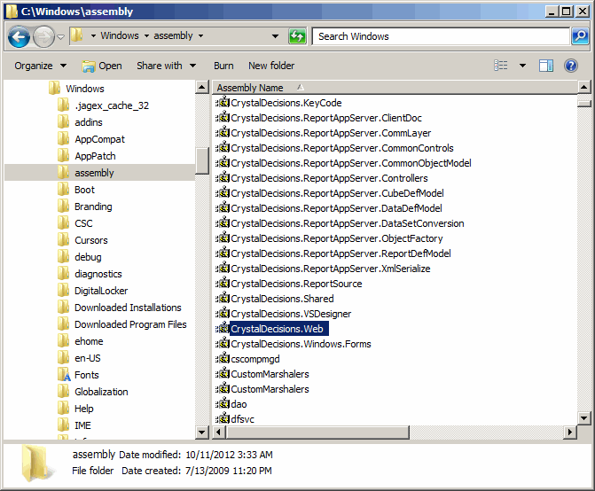

# Late Binding to .NET Objects in .NET 4.0

Originally posted here: https://www.codeproject.com/Articles/485145/Late-Binding-to-NET-Objects-in-NET-4-0

This article talks about late binding to .NET object (not COM objects).



## Introduction
This article shows how to do late binding in .NET. The provided function LoadClass() is similar to CreateObject() function in that you can reference and use external libraries at run time. The library has to be registered with GAC (Global Assembly Cache).

## Background
I wrote a similar article about six years ago on: Planet Source Code. However, that code will work only in .NET 1.1 and 2.0 because Reflection.[Assembly].LoadWithPartialName function has been deprecated in later versions of .NET.

The library does not need to be registered with GAC to late bind to it. You can always institute a class from a DLL by using this simple function:

```VB.NET
Dim o As Object = LoadClass("c:\Microsoft.ReportViewer.WebForms.dll", _
                  "Microsoft.Reporting.WebForms.ReportViewer")

Public Shared Function LoadClass(ByVal sAssemblyPath As String, ByVal sClassName As String) As Object

		'Get Assembly
		Dim oAssembly As Reflection.Assembly
		Try
				oAssembly = Reflection.[Assembly].LoadFrom(sAssemblyPath)
		Catch
				Throw New ArgumentException("Can't load assembly " + sAssemblyPath)
		End Try

		'Get Class
		Dim oType As Type = oAssembly.GetType(sClassName, False, False)
		If oType Is Nothing Then
				Throw New ArgumentException("Can't load type " + sClassName)
		End If

		'Instantiate
		Dim oTypes(-1) As Type
		Dim oInfo As Reflection.ConstructorInfo = oType.GetConstructor(oTypes)
		Dim oRetObj As Object = oInfo.Invoke(Nothing)
		If oRetObj Is Nothing Then
				Throw New ArgumentException("Can't instantiate type " + sClassName)
		End If

		Return oRetObj
End Function
```

## Using the Code

To load a .NET class from GAC, you just need to call LoadClass function like:

```VB.NET
Dim o As Object = AssemblyCache.LoadClass_
("CrystalDecisions.Web", "CrystalDecisions.Web.CrystalReportViewer")
```

Please note that "CrystalDecisions.Web" is the name of the library registered in GAC and "CrystalDecisions.Web.CrystalReportViewer" is the name of the class.
